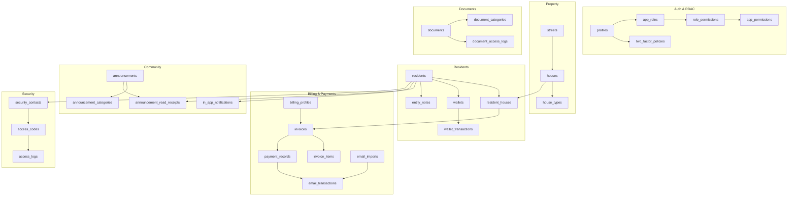

# Database Schema

This document describes the Residio database architecture, including core entities, relationships, triggers, and enums.

---

## Directory Structure

```
src/
├── app/                    # Next.js App Router pages
│   ├── (auth)/            # Auth pages (login)
│   ├── (dashboard)/       # Dashboard protected routes
│   │   ├── dashboard/     # Dashboard home
│   │   ├── houses/        # House management
│   │   ├── residents/     # Resident management
│   │   ├── payments/      # Payment records
│   │   ├── billing/       # Billing & invoices
│   │   ├── security/      # Security contacts
│   │   └── settings/      # Application settings
│   └── api/               # API routes
├── actions/               # Server actions (data layer)
│   ├── billing/          # Invoice generation, wallet
│   ├── dashboard/        # Dashboard stats
│   ├── houses/           # House CRUD
│   ├── payments/         # Payment CRUD
│   ├── reference/        # Streets, house types
│   └── residents/        # Resident CRUD
├── components/
│   ├── ui/               # shadcn/ui base components
│   ├── admin/            # Reference management
│   ├── billing/          # Billing forms
│   ├── dashboard/        # Sidebar, header, navigation
│   ├── houses/           # House table, form
│   ├── payments/         # Payment table, form, filters
│   └── residents/        # Resident table, form
├── hooks/                # React Query hooks
│   ├── use-billing.ts
│   ├── use-dashboard.ts
│   ├── use-houses.ts
│   ├── use-payments.ts
│   ├── use-reference.ts
│   └── use-residents.ts
├── lib/
│   ├── auth/             # Auth provider
│   ├── supabase/         # Supabase clients
│   ├── validators/       # Zod schemas
│   └── utils.ts          # Utility functions
└── types/
    ├── database.ts       # Database type definitions
    └── database.generated.ts  # Auto-generated from schema

supabase/
├── config.toml           # Supabase CLI config
├── migrations/           # SQL migration files
└── seed.sql             # Test user seed data
```

---

## Core Entities

### User & Auth (RBAC v2)

| Table | Description |
|-------|-------------|
| `profiles` | User accounts linked to Supabase Auth with theme overrides |
| `app_roles` | Phase 10: Granular roles with levels and categories |
| `app_permissions` | Phase 10: Specific permissions grouped by category |
| `role_permissions` | Junction table linking roles to permissions |
| `role_assignment_rules` | Rules defining allowed resident role for app roles |
| `two_factor_policies` | 2FA enforcement rules per role |
| `two_factor_tokens` | Active 2FA login/setup tokens |
| `two_factor_backup_codes` | Hashed backup codes for recovery |

### Property

| Table | Description |
|-------|-------------|
| `streets` | Street reference data with short names |
| `house_types` | House type reference data with billing profiles |
| `houses` | Properties in the estate with occupancy status |

### Residents

| Table | Description |
|-------|-------------|
| `residents` | Community members with auto-generated codes, contact verification |
| `resident_houses` | Junction table (many-to-many) for property assignments with roles, sponsor links, live-in flags, and tags |
| `verification_tokens` | OTP tokens for email/phone contact verification |

### Financial

| Table | Description |
|-------|-------------|
| `payment_records` | Payment history with status tracking |
| `wallets` | Resident wallet balances |
| `wallet_transactions` | Wallet credit/debit history |
| `billing_profiles` | Fee schedules and billing configurations |
| `invoices` | Generated invoices per resident |
| `invoice_items` | Line items within invoices |

### Security

| Table | Description |
|-------|-------------|
| `security_contacts` | Visitor/staff access with validity periods |
| `security_contact_categories` | Configurable contact categories |
| `access_codes` | Permanent and one-time access codes |
| `access_logs` | Check-in/check-out recording |

### Community & Communication

| Table | Description |
|-------|-------------|
| `announcements` | Community-wide updates with status and priority |
| `announcement_categories` | Categorization for announcements with visual styles |
| `announcement_read_receipts` | Tracking for resident engagement |
| `in_app_notifications` | Real-time alerts for residents |
| `notification_templates` | Legacy: Message templates with variables |
| `message_templates` | Phase 16: Modern reusable communication templates |
| `report_subscriptions` | Resident preferences for automated reporting |

### Documents

| Table | Description |
|-------|-------------|
| `documents` | Core entity for cloud-stored files with versioning |
| `document_categories` | Folder-like categorization with visibility rules |
| `document_access_logs` | Security audit trail for document interactions |

### Email & Gmail Integration

| Table | Description |
|-------|-------------|
| `gmail_oauth_credentials` | Secure OAuth tokens for Gmail API access |
| `email_imports` | Session tracking for automated bank imports |
| `email_messages` | Individual emails fetched and classification |
| `email_transactions` | Transactions extracted from email alerts/PDFs |
| `bank_statement_imports` | Legacy: Manual statement import sessions |
| `resident_payment_aliases` | Mapping for automated resident matching |
| `estate_bank_account_passwords` | Encrypted passwords for bank PDF decryption |

### System

| Table | Description |
|-------|-------------|
| `audit_logs` | Immutable activity logs across all modules |
| `system_settings` | Core application configuration |
| `impersonation_sessions` | Admin-resident portal preview sessions |
| `approval_requests` | Maker-checker workflow queue |
| `entity_notes` | Polymorphic notes for residents and houses |
| `late_fee_log` | Application history for automated late fees |
| `late_fee_waivers` | Resident requests for fee removal |

---

## Key Features

### Auto-Generated Resident Codes
- 6-digit numeric codes assigned via database trigger
- Unique across all residents
- Cannot be manually overridden

### House Occupancy Tracking
- `is_occupied` boolean auto-updated via trigger
- Tracks when residents are assigned/removed from properties
- Supports ownership history events

### Primary Residence Enforcement
- Each resident can have only one primary residence
- Enforced by database trigger
- Non-primary assignments allowed for multi-property owners

### Emergency Contacts
- Can link to existing resident (by ID)
- Or manual entry with name/phone

### Resident-House Assignment (`resident_houses`)
The junction table manages many-to-many relationships between residents and houses:

| Column | Type | Description |
|--------|------|-------------|
| `resident_id` | UUID | Reference to resident |
| `house_id` | UUID | Reference to house |
| `resident_role` | enum | Role in this property (see `resident_role` enum) |
| `is_primary` | boolean | Primary residence flag (One Home policy) |
| `move_in_date` | date | Date moved into property |
| `move_out_date` | date | Date moved out (null if active) |
| `is_active` | boolean | Current active assignment |
| `sponsor_resident_id` | UUID | Sponsor for secondary roles |
| `is_live_in` | boolean | For domestic_staff: live-in vs. visiting |
| `tags` | text[] | Flexible attributes array |

### Contact Verification
Residents can verify their email and phone via OTP:
- `verification_tokens` table stores time-limited OTP codes
- `residents.email_verified_at` / `phone_verified_at` track verification status
- Verification required for certain app roles (configurable per role)

### Billing Profiles
- Attached to house types for automated invoice generation
- Supports one-time levies and recurring fees
- Development levy flag for flat-fee billing

---

## Database Triggers

### `generate_resident_code()`
- **Fires**: BEFORE INSERT on `residents`
- **Purpose**: Generates unique 6-digit resident code
- **Logic**: Random generation with collision checking

### `update_house_occupancy()`
- **Fires**: AFTER INSERT/DELETE on `resident_houses`
- **Purpose**: Updates `houses.is_occupied` based on active assignments
- **Logic**: Sets `is_occupied = TRUE` if any resident linked

### `enforce_primary_residence()`
- **Fires**: BEFORE INSERT/UPDATE on `resident_houses`
- **Purpose**: Ensures only one primary residence per resident
- **Logic**: Clears previous primary if new assignment is marked primary

### `create_wallet_for_resident()`
- **Fires**: AFTER INSERT on `residents`
- **Purpose**: Auto-creates wallet with zero balance
- **Logic**: Inserts into `wallets` with `resident_id`

### `create_profile_for_user()`
- **Fires**: AFTER INSERT on `auth.users`
- **Purpose**: Creates `profiles` record on Supabase Auth signup
- **Logic**: Copies email and sets default role

---

## Enums

### `resident_role`
Defines the relationship a resident has to a property. Updated in Phase 15 to include contractor role.

**Primary Roles** (can exist independently - relationship holders):
```sql
'resident_landlord'     -- Owner who resides in the unit
'non_resident_landlord' -- Non-resident owner (landlord)
'tenant'                -- Leaseholder who resides in the unit
'developer'             -- Developer holding unsold inventory
```

**Secondary Roles** (must be attached to a primary resident via sponsor):
```sql
'co_resident'           -- Adult residing in unit not on title/lease
'household_member'      -- Family dependents (spouse, children)
'domestic_staff'        -- Employees working/living at the unit
'caretaker'             -- Assigned to maintain a vacant unit
'contractor'            -- External service providers (plumbers, electricians, etc.)
```

**Sponsor Requirement**: `domestic_staff`, `caretaker`, and `contractor` roles require a `sponsor_resident_id` linking them to a primary resident.

**Live-In Flag**: For `domestic_staff` role, `is_live_in` boolean distinguishes:
- `true` = Live-in staff (resides at property)
- `false` = Visiting staff (works at property but lives elsewhere)

**Tags/Attributes**: The `tags` text array field allows flexible attributes like `['elderly', 'parking_permit', 'pool_access']` without schema changes.

### `resident_type`
```sql
'primary'   -- Primary resident (can have independent roles)
'secondary' -- Secondary resident (individuals only)
```

### `entity_type`
```sql
'individual' -- Person
'corporate'  -- Company (can only be non_resident_landlord or developer)
```

### `account_status`
```sql
'active' | 'inactive' | 'suspended' | 'archived'
```

### `verification_status`
```sql
'pending' | 'submitted' | 'verified' | 'rejected'
```

### `payment_status`
```sql
'pending' | 'completed' | 'failed' | 'refunded'
```

### `invoice_status`
```sql
'draft' | 'pending' | 'paid' | 'partially_paid' | 'overdue' | 'cancelled'
```

### `security_contact_status`
```sql
'active' | 'suspended' | 'expired' | 'revoked'
```

### `access_code_type`
```sql
'permanent' | 'one_time'
```

### `id_document_type`
```sql
'nin' | 'drivers_license' | 'passport' | 'voters_card' | 'company_id' | 'other'
```

### `notification_channel`
```sql
'email' | 'sms' | 'whatsapp' | 'in_app'
```

### `audit_action`
```sql
'CREATE' | 'UPDATE' | 'DELETE' | 'VERIFY' | 'APPROVE' | 'REJECT' |
'ASSIGN' | 'UNASSIGN' | 'ACTIVATE' | 'DEACTIVATE' | 'GENERATE' | 
'ALLOCATE' | 'TRANSFER' | 'BULK_UPDATE' | 'LOGIN' | 'LOGOUT'
```

---

## Entity Relationships



---

## Type Definitions

Database types are defined in two files:

- `src/types/database.ts` - Manual type definitions with convenience aliases
- `src/types/database.generated.ts` - Auto-generated from schema via `npm run db:types`

### Convenience Type Aliases

```typescript
// From src/types/database.ts
export type Resident = Tables<'residents'>;
export type House = Tables<'houses'>;
export type ResidentWithHouses = Resident & { houses: House[] };
export type HouseWithResidents = House & { residents: Resident[] };
export type PaymentRecord = Tables<'payment_records'>;
export type Invoice = Tables<'invoices'>;
export type SecurityContact = Tables<'security_contacts'>;
export type AuditLog = Tables<'audit_logs'>;
```

---

## Migrations

All migrations are stored in `supabase/migrations/` with timestamp prefixes.

To regenerate TypeScript types after schema changes:
```bash
npm run db:types
```

For detailed migration commands, see [Supabase Integration](../api/supabase-integration.md#mcp-tools-reference).
