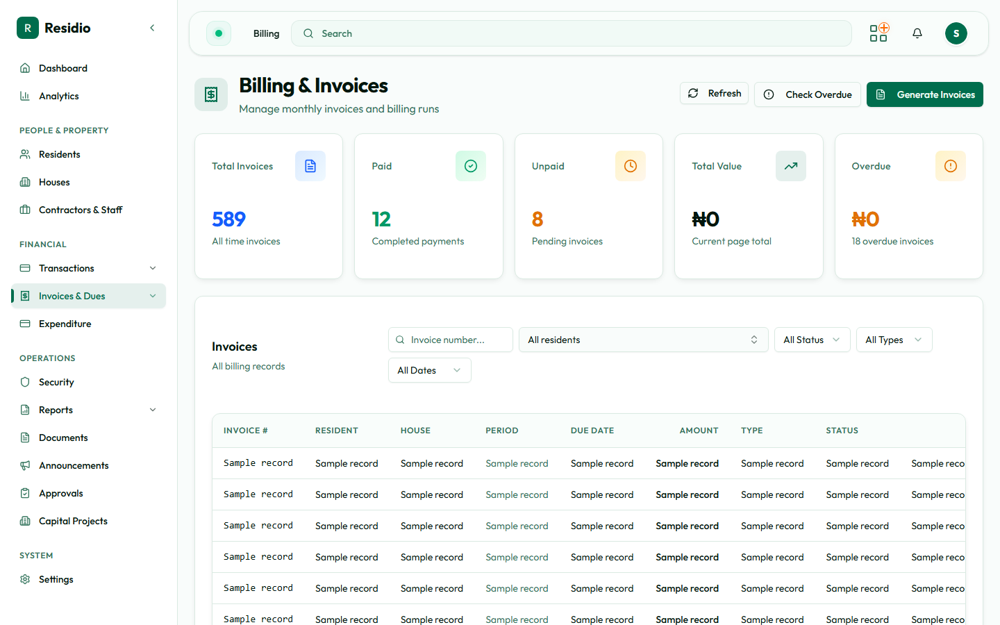

# Invoices and dues

Open **Invoices & Dues** to review the estate's billing position and work with invoice records.

## Review the queue

Use status filters for **unpaid**, **partial**, **paid**, **overdue**, and **void**. Combine the status with a month, house, street, or resident filter to narrow the working set.

## Generate invoices

1. Select **Generate Invoices**.
2. Choose the target month and scope.
3. Review the preview counts, warnings, eligible houses, residents, and existing invoices.
4. Confirm the options for wallet allocation, resident emails, and late fees.
5. For a backfill, enter the displayed security code exactly.
6. Prepare the durable run and monitor its progress.

:::warning[Preview before prepare]
The preview is the control point. Do not prepare a run until the candidate count and warnings match the intended period and scope.
:::

## Handle an exception

Open the invoice detail page to inspect the resident, house, billing period, payments, wallet allocation, and audit history. Do not manually create a replacement invoice until you have confirmed the business key and current run status.
