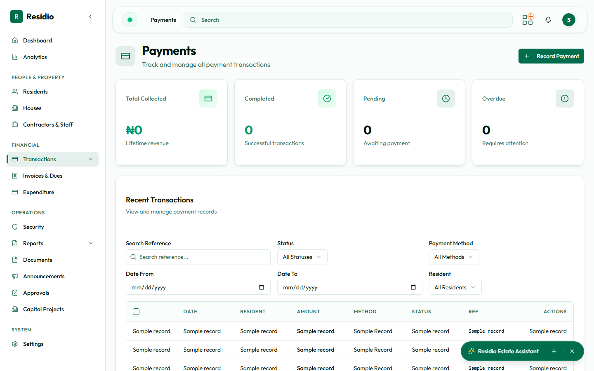

# Payments and statement imports

Use **Transactions** for individual payment records and **Import Statement** for bank statement workflows.

## Record a payment manually

1. Select **Record Payment**.
2. Identify the resident or house before entering the amount.
3. Enter the payment date, reference, account, and source details.
4. Review the allocation preview.
5. Save the payment and confirm the success notification.

## Import a statement

1. Open **Transactions → Import Statement**.
2. Upload the approved statement file.
3. Review parsed rows and duplicate warnings.
4. Correct categorization or matching issues in the preview.
5. Commit only after the total and row count match the source statement.

## Verify pending payments

Open **Approvals** for transactions awaiting maker-checker verification. The reviewer should compare the submitted evidence with the transaction before approving or rejecting it.
