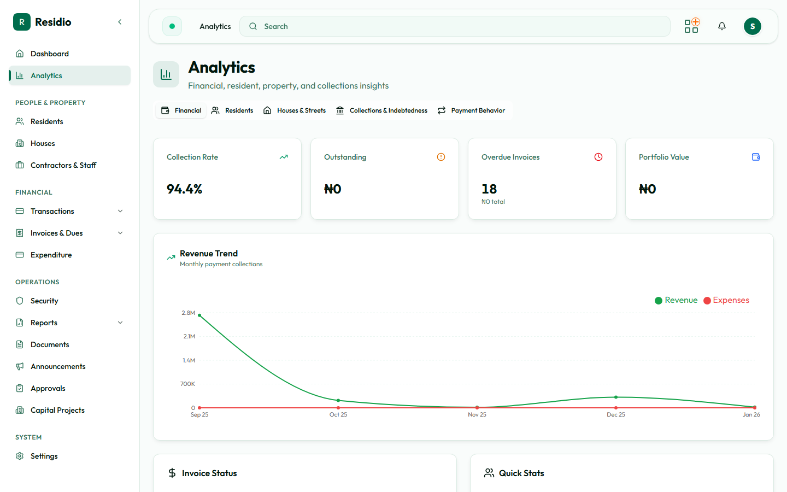

# Reports and analytics

Use **Analytics** for trends and **Reports** for generated operational or financial outputs.

## Analytics workflow

1. Choose the tab that matches the question: financial, residents, houses and streets, collections, indebtedness, or payment behavior.
2. Set the period or filter.
3. Read the summary cards first.
4. Use the chart to locate the trend, then open the source module for record-level action.

## Report workflow

1. Open **Reports**.
2. Select the report type and period.
3. Review the preview or parameters.
4. Generate and download the report only after confirming the scope.

Reports are snapshots. If a number looks wrong, trace it back to residents, invoices, payments, or expenditure instead of editing the report output.
