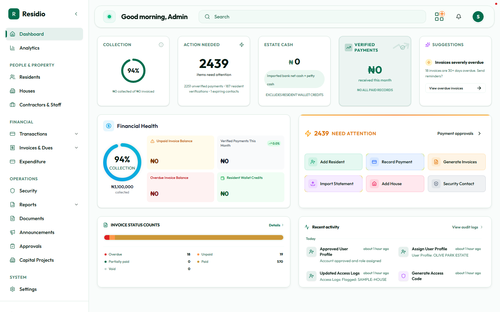
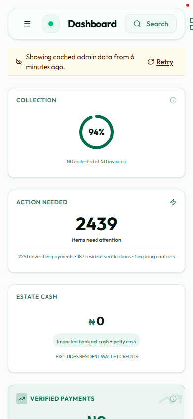

# Dashboard overview

The dashboard is your operating picture for the estate. Start here before opening a module: it shows collection health, work waiting for approval, recent activity, and shortcuts into the workflows you use most.

The dashboard is a triage surface: use the cards to decide what needs attention, then follow the link into the source record.

On a phone, use the header menu to reach the core admin modules.

## Read the page in this order

1. **Collection:** compare the collected amount with the expected invoice total.
2. **Action Needed:** open approvals when the count is non-zero. This is the fastest way to find blocked work.
3. **Financial Health:** scan outstanding, overdue, monthly revenue, and wallet credit values.
4. **Payments Traffic:** use the status counts to decide whether to inspect billing or payments.
5. **Audit Pulse:** confirm recent changes are expected and traceable.

:::tip[Daily habit]
Use the dashboard as a queue, not a report. Resolve the highest-risk exception first, then refresh before starting the next task.
:::

## Quick actions

The lower action row provides shortcuts for adding a resident, recording a payment, generating invoices, importing a statement, adding a house, and creating a security contact. These links open the same workflows as the sidebar.

## What the numbers mean

- **Unpaid:** an invoice has no settled payment.
- **Partial:** a payment exists but the invoice is not fully settled.
- **Overdue:** the invoice has passed its due date without full settlement.
- **Pending verification:** a submitted payment still needs maker-checker review.
- **Wallet credits:** resident funds available for invoice allocation.

Numbers are permission-filtered. A user with a narrower role may see fewer cards or a different set of navigation links.
