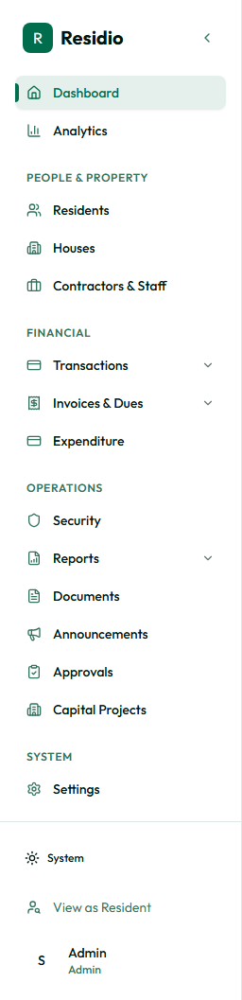

# Navigation and search

Residio groups work by responsibility rather than by database table.

## Sidebar groups

- **Core:** dashboard and analytics.
- **People & Property:** residents, houses, and contractors or staff.
- **Financial:** transactions, imports, invoices, and expenditure.
- **Operations:** security, reports, documents, announcements, approvals, and capital projects.
- **System:** settings and estate configuration.

On desktop, hover over the collapsed sidebar to reveal labels. On mobile, use **Toggle menu** in the header.

## Search

Select **Search** in the header to search the records available to your role. Use a resident code, name, house label, transaction reference, or announcement title. Search results remain permission-filtered.

## Navigation rules

- If a module is not visible, your role likely does not have its view permission.
- A page can be reachable by a direct link but still deny actions without the required create, update, or delete permission.
- Use the breadcrumb or module link to return to the list rather than using browser history after a successful write.
