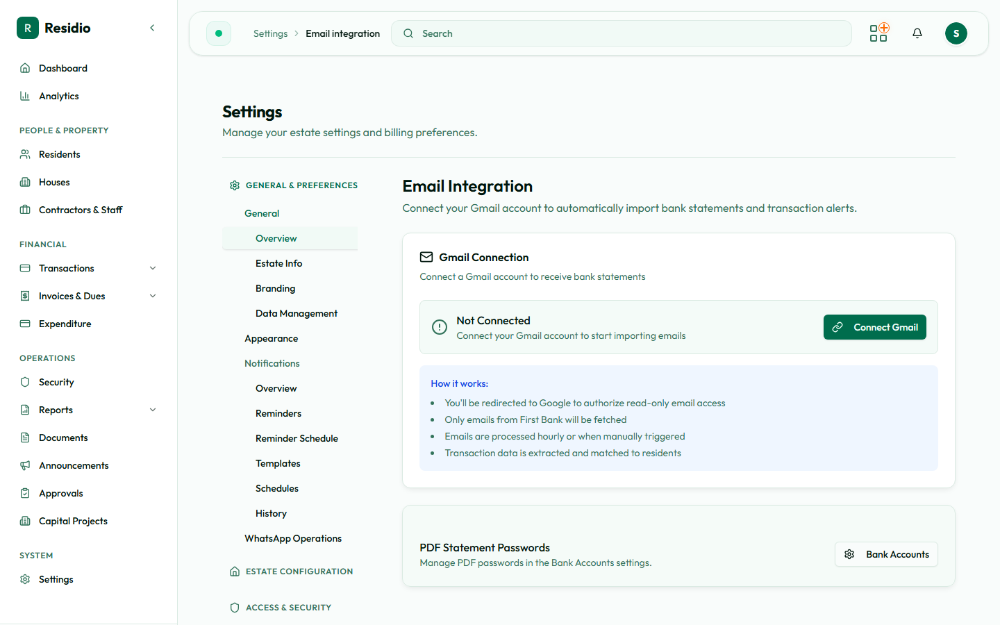

# Gmail import and bank feeds

Residio gets bank data into the system through two routes: an automated Gmail connection that reads bank alerts and statement attachments, and manual file upload from **Transactions → Import Statement**. Both land in the same review queue, and neither posts a payment without review.

For the day-to-day payment workflow, see [Payments and statement imports](../finance/payments-and-imports). This page covers the connection itself.

## Connect a Gmail mailbox

Open **Settings → Email Integration**.

1. Select **Connect** and complete the Google consent screen.
2. Grant access with the mailbox that actually receives the bank alerts, not a personal account.
3. Confirm the page returns showing a connected status and a mailbox address.
4. Check the sync criteria so Residio reads only the relevant mail.
5. Wait for the first sync, then confirm imports appear.

The page shows the connection status and the last sync time. A connection that reports connected but has never synced is a criteria problem, not an authorisation problem.

:::warning[Use an estate mailbox]
Connecting a personal Gmail account ties the estate's bank feed to one person's credentials. When they leave or change their password, the feed stops. Use a mailbox the estate controls.
:::

### Disconnect

**Disconnect** revokes Residio's access and stops future syncs. Imports already created stay in the system. Disconnect before handing over a mailbox, and reconnect with the replacement account rather than sharing credentials.

## What gets imported

The importer recognises FirstBank Nigeria transaction alerts and FirstBank statement PDFs. Statement files uploaded manually are parsed from CSV, Excel, and PDF.

Column names vary between statement types, so the parser accepts common variations of each field — transaction date, narration, credit, debit, reference, and balance. If a statement fails to parse, the most likely cause is an unrecognised export format from the bank, not a corrupted file.

## Password-protected statements

Bank statement PDFs are often password protected. Residio stores a password per bank account so scheduled imports can open them without manual intervention. Manage these under the bank account record.

Passwords are stored encrypted and are never displayed back. To change one, set a new value; to stop automated opening, remove it.

## The review queue

Imported rows are matched against residents, houses, and outstanding invoices, then queued for review. Nothing is posted automatically.

For each queued row you can:

- **Process** it, which creates the payment and applies the allocation.
- **Skip** it, when the credit is not a resident payment.
- Leave it, when you need to confirm something first.

Work the queue regularly. A backlog makes duplicate detection harder, because the same credit may arrive twice — once as an alert and once on the statement.

## Managing an import run

An import that is stuck or wrong can be controlled directly.

- **Retry** re-runs parsing and matching for the import. Use it after fixing a bank password or a matching rule.
- **Cancel** stops an import that should not proceed.

Both actions require the email import permission and are written to the audit log.

## Automatic syncing

Residio checks the connected mailbox on an hourly schedule. If imports stop appearing, confirm the job is running under **Settings → Cron Status** before assuming the Gmail connection has failed. See [Scheduled jobs](./scheduled-jobs).

## Troubleshooting

| Symptom | Check |
|---|---|
| Connected, but no imports | Sync criteria are too narrow, or the bank mails a different address |
| Imports appear but never parse | The statement format is unrecognised — capture a sample and escalate |
| PDF imports fail | No stored password for that bank account, or the password changed |
| Rows import but match nothing | Resident or house records missing the reference the bank sends |
| Duplicate payments | The same credit arrived as both an alert and a statement row — skip the duplicate, do not delete the payment |
