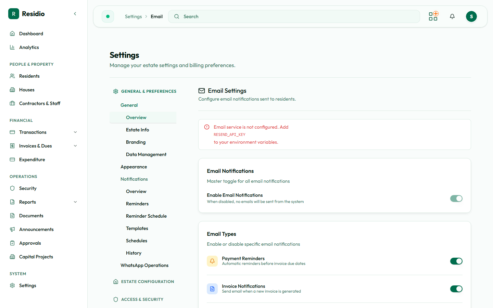

# Email and SMS channels

Residio sends resident communication over three channels: email, SMS, and in-app notification. Email and SMS both depend on an external provider, so both can be configured correctly in the dashboard and still fail at the provider.

## Email

Open **Settings → Email**. The page reports whether email is configured on the server before it shows any toggles — read that banner first. If it says email is not configured, no toggle on the page will produce a delivered message, and the fix is a server credential change by an engineer.

The toggles control which categories of email Residio sends: notifications, invoices and receipts, and account or invitation mail. Turn a category off when you want to suppress a class of message without disabling the whole channel.

**Settings → Email → Debug** shows recent send attempts and their outcomes. Use it to distinguish "Residio never tried to send" from "the provider rejected it".

## SMS

SMS is used for a narrower set of messages: emergency broadcasts, verification codes, and two-factor codes. It is more expensive and more intrusive than email, so it should not be the default channel for routine billing communication.

Configure SMS behaviour from **Settings → Notifications**, alongside the other channels.

:::warning[Emergency broadcasts reach everyone immediately]
A multi-channel emergency announcement bypasses the normal reminder cadence. Confirm the message text and the recipient scope with the estate lead before sending.
:::

## Templates

**Settings → Message Templates** and **Settings → Notifications → Templates** hold the message bodies. A template change takes effect on the next send, including sends already sitting in the queue.

Before saving a template change:

1. Read the rendered preview, not just the source.
2. Confirm every placeholder resolves — an unresolved placeholder reaches the resident verbatim.
3. Check the message reads correctly in the shortest channel it will be sent on. SMS truncates.
4. Send one test message to yourself.

## Reminders and schedules

**Settings → Notifications → Reminders** defines which billing events trigger a message, and **Schedules** defines when. Reminders are dispatched by a scheduled job rather than at the moment you save them, so a saved reminder that has not arrived yet is usually waiting for its next run, not broken.

## The notification queue

**System → Notification Queue** shows messages that Residio has created but not yet delivered. A healthy queue drains on each scheduled run.

| Queue state | Meaning |
|---|---|
| Small, draining | Normal |
| Growing steadily | The processing job is not running — check **Settings → Cron Status** |
| Stuck with failures | The provider is rejecting sends — check the email debug page |

Do not clear the queue to make a warning disappear. Clearing it discards messages residents were owed and destroys the evidence needed to diagnose the failure.

## History

**Settings → Notifications → History** is the record of what was actually sent, to whom, and when. Use it to answer a resident who says they were never notified, before assuming a delivery fault.
