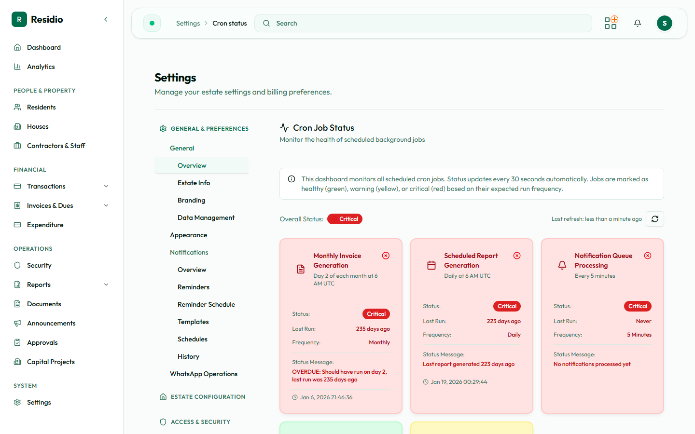

# Scheduled jobs

Much of Residio's routine work runs on a schedule rather than when you press a button. Invoices generate, reminders send, reports deliver, and mailboxes sync without anyone signing in. When something "did not happen", a scheduled job is usually the answer.

Monitor them from **System → Cron Status**. This moved out of Settings because job status is something you watch, not something you configure — see [Troubleshooting](../administration/troubleshooting.md).

## The schedule

Times are in UTC. Adjust for your estate's local time when reasoning about when residents will see the effect.

| Job | Runs | What it does |
|---|---|---|
| Payment cadence refresh | Daily, 00:00 | Recalculates resident payment cadence |
| WhatsApp retention purge | Daily, 00:15 | Removes expired WhatsApp sessions and processed messages |
| Invoice generation | Daily, 06:00 | Generates recurring invoices that are due |
| Report generation | Daily, 06:00 | Builds scheduled reports |
| Report schedule processing | Daily, 07:00 | Delivers reports to their subscribers |
| Payment reminders | Daily, 08:00 | Queues reminder messages for outstanding balances |
| Notification processing | Daily, 09:00 | Sends what is waiting in the notification queue |
| Announcement publishing | Hourly | Publishes announcements whose scheduled time has arrived |
| Email import | Hourly | Reads the connected mailbox for bank alerts and statements |

A late fee job also exists as an endpoint but is not on the platform schedule. If your estate charges late fees, confirm with an engineer how that run is triggered before assuming it is automatic.

## Reading the status page

**System → Cron Status** reports each monitored job as healthy, warning, critical, or unknown, alongside an overall status. It refreshes on its own while open.

| Status | What it means |
|---|---|
| Healthy | The job ran within its expected window |
| Warning | The job is overdue but not yet critical |
| Critical | The job has not run for long enough to affect residents |
| Unknown | No run has been recorded — normal for a new deployment, otherwise investigate |

A warning is a prompt to look, not a reason to act. Check the status page before manually generating invoices or resending notifications — a job that is merely late will otherwise run afterwards and duplicate your manual work.

### Two jobs report against the wrong expectation

The status page judges each job against a frequency it declares internally, and for two jobs that frequency does not match the schedule the platform actually runs.

| Job | Status page expects | Actually scheduled |
|---|---|---|
| Notification processing | Every 5 minutes | Daily, 09:00 |
| Invoice generation | Monthly, on a set day | Daily, 06:00 |

The practical effect is that **notification processing reports Critical almost permanently**, because it is measured against a five-minute window it was never scheduled to meet. Read that particular card against the queue itself rather than the badge: if **System → Notification Queue** is draining daily, the job is working.

Treat this as a known reporting fault, not an outage. It is being tracked for repair.

## When a job has not run

1. Confirm the status on **System → Cron Status**.
2. Check whether the estate is in maintenance mode, which suppresses scheduled work.
3. Check the downstream surface — the notification queue, the import list, the invoice list — to see how much is outstanding.
4. If the job is genuinely not running, escalate to an engineer. Job scheduling is a deployment concern, not a dashboard setting.
5. Only after that, consider a manual run of the equivalent action.

:::warning[Manual runs can duplicate]
Generating invoices manually while the scheduled run is merely delayed produces two sets. Confirm the job status first, and check the run history before triggering anything by hand.
:::

## Authentication

Scheduled endpoints are protected by a shared secret and reject any call that does not present it. They are not open URLs, and they are not something an administrator triggers by visiting a link. Manual runs are done from the dashboard actions that expose them — invoice generation has a run history for exactly this reason.

## Related

- [Email and SMS channels](./email-and-sms) for the notification queue
- [Gmail import and bank feeds](./bank-feeds-and-email-import) for the hourly mailbox sync
- [WhatsApp operations](./whatsapp-operations) for the retention purge
- [Access and system health](../settings/access-and-system-health) for maintenance mode
