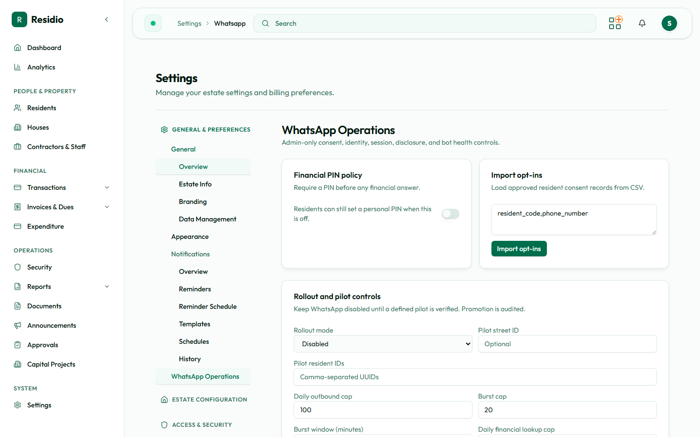

# WhatsApp operations

Residio connects to the WhatsApp Cloud API so residents can message the estate and receive answers, including balance and payment questions. Because the channel reaches residents directly and can disclose financial information, it ships **disabled** and is promoted deliberately.

All controls are on **Settings → WhatsApp**, and every promotion is audited.

## Connecting a provider

Before any message can be sent, the estate needs a WhatsApp provider connected. This no longer needs a developer or a redeploy — an admin with access to **Settings → WhatsApp** can connect, replace, or disconnect the provider directly from the connection card at the top of the page.

Choose one of two providers:

| Provider | Why choose it |
|---|---|
| **Meta** (recommended) | Connects directly to the WhatsApp Cloud API, with no per-message middleman. |
| **Twilio** | Adds a per-message cost on top of WhatsApp's own fees. Worth it mainly if the estate already runs other messaging through Twilio. |

Whichever provider is chosen, have these details ready before you start:

| Provider | What you need |
|---|---|
| Meta | Access token, phone number ID, verify token, app secret |
| Twilio | Account SID, auth token, a WhatsApp-enabled from-number |

These all come from the provider's own console, not from Residio.

### The webhook callback URL

The connection card shows a **webhook callback URL** with a copy button. Paste this into the provider's console so it knows where to deliver incoming messages and status updates.

If you're connecting Meta, the console also asks for a **verify token**. Residio shows this to you once, immediately after you save the connection — copy it into Meta's console at that moment. It cannot be retrieved again afterwards; if you lose it, save the connection again to generate a new one.

:::warning[Copy the verify token immediately]
The Meta verify token is only ever shown once, right after saving. Navigate away before copying it and you will need to reconnect to get a new one.
:::

### Test the connection

Use the **Test connection** button to confirm the saved credentials actually work. Residio makes a lightweight call to the provider and reports back pass or fail. A failure means the provider rejected the stored credentials — double-check the values against the provider's console, particularly the access token or auth token, and try again. It does not mean anything was sent to a resident.

### How credentials are kept

Secrets — access token, verify token, app secret, auth token — are encrypted before they are stored, and Residio never displays them again after saving. The connection card only ever shows whether a credential is set, plus the non-secret details such as the phone number ID or from-number and who last saved the connection.

To change a secret, use **Replace credentials** and enter it again in full; there is no way to view or partially edit a stored secret.

### Disconnecting

**Disconnect** removes the saved connection. Once disconnected, Residio falls back to whatever WhatsApp credentials are set in the deployment's environment variables, if any are configured there. Use this if a connection was set up in error, or while handing a provider account over to a new administrator.

### Twilio: mapping templates to Content SIDs

If the estate uses Twilio, each approved message template also needs a Twilio **Content SID** before it can be sent. Residio only ever sends from a fixed, pre-approved list of template names — the Content SID mapping tells Twilio which of its approved content items corresponds to each of those names. Set this mapping from the connection card once Twilio is connected.

A template with no Content SID mapped fails to send rather than going out as unapproved free text — this is a deliberate compliance guard, not a bug to work around by leaving a mapping blank.

## Turning the channel on

Connecting a provider does not by itself let messages flow. A separate **master on/off switch** on the WhatsApp settings page decides whether the channel runs at all — it defaults to **off** and must be switched on deliberately, even after a provider is connected and tested.

This is distinct from the rollout mode described below: the master switch decides *whether the channel runs*; rollout mode decides *who receives messages once it does*. Both must be set correctly for residents to receive anything.

## Rollout modes

| Mode | Who receives messages |
|---|---|
| `Disabled` | Nobody. Outbound is blocked entirely. This is the default. |
| `Pilot` | Only named residents, plus every resident on one nominated street. |
| `Estate` | All residents. |

Use **Rollout and pilot controls** to set the mode. In pilot mode you supply a list of resident IDs, a pilot street, or both — a resident matching either rule is included.

### Promote a pilot to the estate

1. Confirm the pilot has run long enough to see a full billing cycle.
2. Review the operations console for delivery failures and template errors.
3. Confirm the daily and burst caps are sized for the full estate, not the pilot.
4. Change the mode to `Estate`.
5. Record who approved the promotion. The change is written to the audit log.

:::warning[Do not skip the pilot]
Moving straight from `Disabled` to `Estate` sends the first real message to every resident at once. A template error at that point is not recoverable.
:::

## Consent and opt-ins

A resident only receives WhatsApp messages after an approved consent record exists.

- **Import opt-ins** loads approved consent records from CSV in bulk.
- The operations console lists current opt-ins and any pending contacts awaiting confirmation.

Pending contacts are people who have messaged the number but are not yet matched to a resident record. Resolve them by confirming identity against the resident directory — never by guessing from the phone number alone.

## Financial PIN policy

**Financial PIN policy** controls whether a PIN is required before Residio answers any financial question over WhatsApp.

- When the policy is **on**, every resident must enter a PIN before a balance, invoice, or payment answer is returned.
- When it is **off**, residents may still set a personal PIN for themselves.

Leave the policy on for estates where phones are commonly shared.

## Rate caps

Caps protect residents from a runaway loop and protect the estate from provider throttling.

| Cap | Purpose |
|---|---|
| Outbound daily cap | Maximum messages sent in a day |
| Outbound burst cap | Maximum messages within the burst window |
| Burst window (minutes) | The window the burst cap is measured over |
| Financial lookup daily cap | Maximum financial answers returned in a day |

When a cap is reached, further sends are blocked and the event is counted in the console as a cap limit event. Repeated cap events mean the cap is wrong for the estate size or something is sending in a loop — investigate before raising the number.

## The operations console

The console on the same page shows today's activity: inbound messages, outbound messages, delivery failures, template errors, and cap limit events. It also lists active sessions and the disclosure log.

The **disclosure log** records every occasion on which financial information was released over WhatsApp. Treat it as an audit surface: it is the evidence that a disclosure was authorised, and it should never be cleared to tidy a screen.

## Data retention

WhatsApp operational state is short-lived by design and purged on a daily schedule.

- Sessions are removed after they expire, by default the next day.
- Processed message records are removed after their expiry, by default two days.

The cleanup runs automatically shortly after midnight, documented on the Scheduled jobs page in this section.

## Troubleshooting

| Symptom | Check |
|---|---|
| Nothing sends | No provider is connected, the master switch is off, rollout mode is `Disabled`, or the recipient is outside the pilot scope |
| One resident receives nothing | No approved opt-in record for that resident |
| Sends stop partway through a day | A daily or burst cap has been reached |
| Financial questions go unanswered | The resident has no PIN set while the PIN policy is on |
| Test connection fails | The provider rejected the saved credentials — recheck the access token or auth token against the provider's console |
| Twilio template fails to send | No Content SID mapped for that template name — map it on the connection card |
| Delivery failures climbing | Provider credentials or template approval — escalate to an engineer |
| Inbound messages ignored | Webhook verification is failing at the provider — escalate to an engineer |
