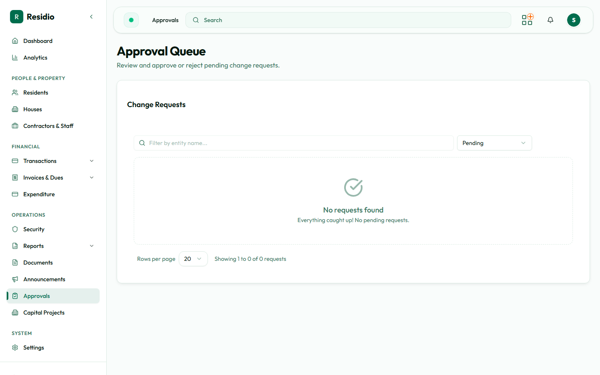

# Approvals and announcements

## Approvals

Open **Approvals** from the dashboard or sidebar. Review the source record, evidence, submitter, amount, and history before approving or rejecting an item.

Use the approval decision that matches the evidence. If the record is incomplete, reject it with a useful reason or leave it pending according to the estate process.

## Announcements

1. Open **Announcements → New Announcement**.
2. Choose the category and priority.
3. Write a short, action-oriented title.
4. Add the message, audience, and schedule.
5. Preview the result before publishing.
6. Publish immediately only for time-sensitive communication.

:::tip[Clear communication]
Put the action and deadline in the first two lines. Use emergency priority only when the message needs immediate attention.
:::
