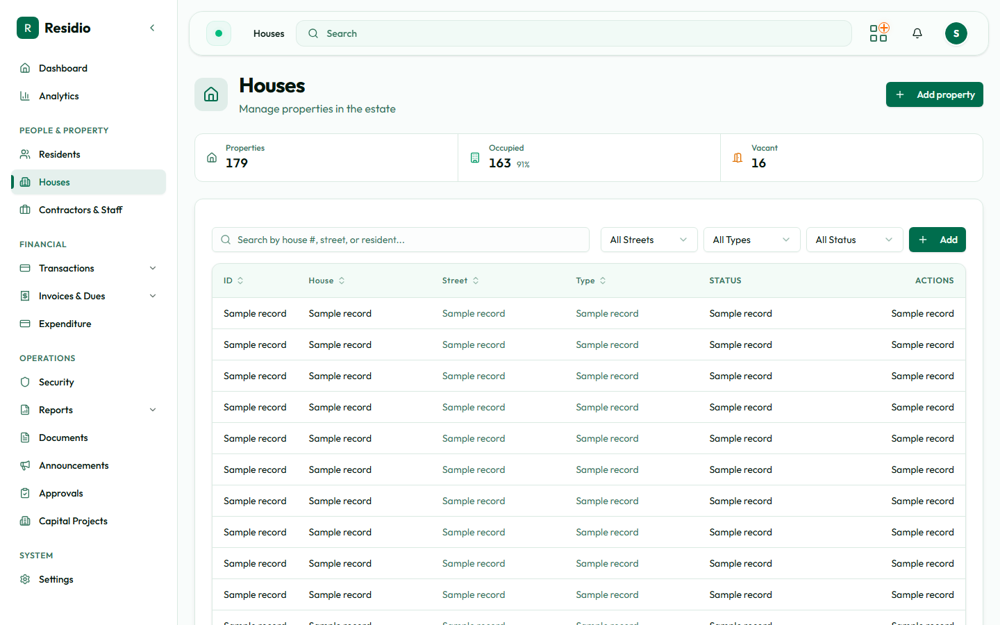

# Houses and occupancy

Open **Houses** to inspect the property registry, current occupancy, street, house type, and linked residents.

## Find a property

1. Search by house label or short name.
2. Filter by street, house type, occupancy, or active status.
3. Open the property to review current residents and ownership history.

## Occupancy is not a manual label

Occupancy is derived from active resident-house assignments. If the displayed state is unexpected, inspect the assignment history and active roles before editing the house itself.

## Add a house

Use **Add House** for a new property. Select the correct street and house type, enter the estate display label, review the details, and save. Do not reuse an existing label.
