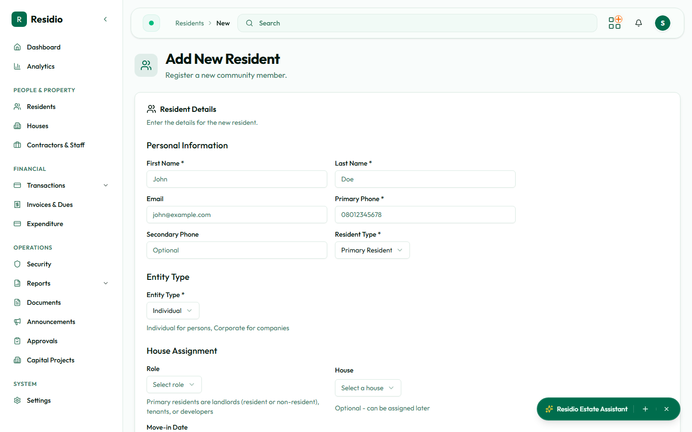

# Add and assign a resident

Use this workflow when a new resident needs an account and a property assignment.

## Before you begin

- Confirm the person does not already exist in **Residents**.
- Confirm the house and the intended resident role.
- Have a reliable phone number or email for future verification.

## Create the record

1. Open **Residents → Add Resident**.
2. Enter the identity and contact details.
3. Select the resident type and occupancy role.
4. Add the house assignment when the form provides it, or save and assign it from the resident detail page.
5. Review the summary carefully, then select **Create resident**.
6. Record the generated resident code in the approved estate process.

:::warning Duplicate prevention
Do not create a second record because a resident has changed phone number, role, or house. Update the existing record instead.
:::

## After creation

Open the new resident profile and confirm the house, role, active status, and financial standing. The create event should appear in **Audit Logs**.
