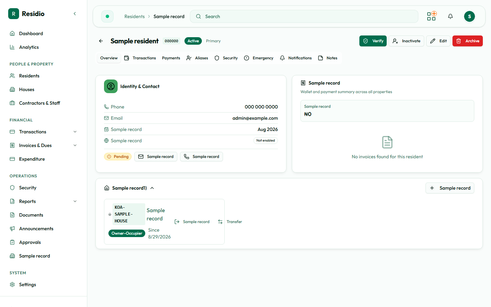

# Resident details

The resident profile is the best place to understand one person across identity, property, finance, and activity.

## Profile sections

- **Identity and contact:** canonical name, code, phone, email, and resident type.
- **Property assignment:** current houses, occupancy role, and assignment history.
- **Financial summary:** invoice balance, payment standing, and wallet credit.
- **Activity:** relevant audit or operational history.

Use the edit action only when the source information has been verified. Changes to assignments can affect billing and access decisions.

## Safe update sequence

1. Open the resident from the directory.
2. Confirm you are on the correct record by resident code and house.
3. Change only the fields supported by the current source document.
4. Save once and wait for the success notification.
5. Refresh the profile and confirm the new value.
