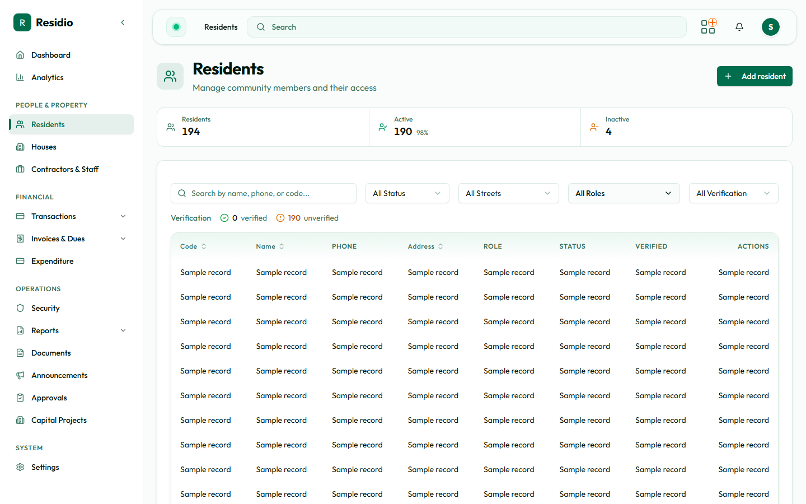

# Resident directory

Open **Residents** from the sidebar to see the estate roster. Use the search and filters before creating a new record so you do not create a duplicate.

## Find a resident

1. Search by name, resident code, phone number, or email.
2. Filter by active status, resident type, or property assignment.
3. Open a row to inspect the resident profile, house assignments, invoices, wallet, and activity.

## Directory hygiene

- Keep one canonical resident record per person.
- Use the resident code when communicating with finance or support.
- Mark a resident inactive only after confirming the move-out or account-closure workflow.
- Preserve relevant notes and assignment history rather than overwriting historical context.

## Next steps

- [Add and assign a resident](./add-and-assign-resident)
- [Review resident details](./resident-details)
