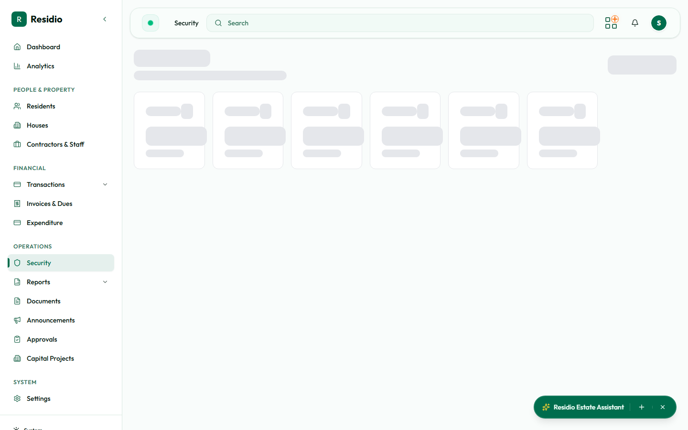

# Security contacts

Open **Security** to review active contacts, access information, and security activity.

## Add a contact

1. Select **Add Security Contact**.
2. Enter the contact identity and phone details.
3. Link the contact to the correct resident or property where required.
4. Set the validity period and access category.
5. Review the details and save.

## Maintain the list

Filter by active status, category, resident, or expiration. End or update a contact when the underlying authorization changes. Avoid deleting historical records when the workflow provides an end or deactivate action.

:::warning Access data
Treat contact details and access codes as sensitive operational data. Do not copy them into chat, screenshots, or external spreadsheets.
:::
