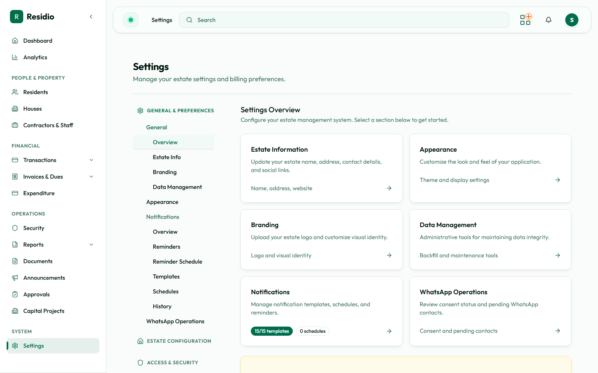

# Settings overview

Settings are grouped by the decision they control.

- **General & Preferences:** estate identity, branding, appearance, notifications, WhatsApp operations.
- **Estate Configuration:** streets, house types, document categories, and transaction tags.
- **Access & Security:** roles and their access, security settings, security contact categories, and audit logs.
- **Billing & Finance:** billing rules, late fees, invoice generation, levies, profiles, bank accounts, and imports.
- **Communications:** email, message templates, and announcement categories.
- **System Health:** maintenance, retention, health checks, cron status, and notification queue.

:::info[You see only what you can open]
Both this page and the Settings sidebar show only the sections your role can actually reach, so two admins will see different menus. If a colleague cannot find a page described in this guide, their role does not hold the permission for it — see [Roles and permissions](../getting-started/roles-and-permissions.md). The Chairman role can open Settings and navigate to the areas their permissions allow — announcements, documents, billing profiles, email imports, notifications, security categories, and WhatsApp — but does not see configuration pages or system maintenance.
:::

Change one setting at a time, save, and verify the affected workflow. Configuration changes can alter what other admins see or what automated jobs do.
